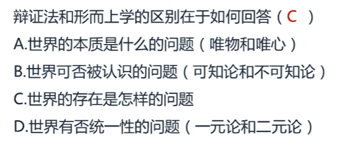
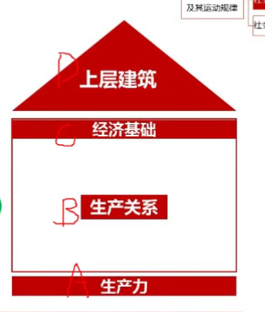
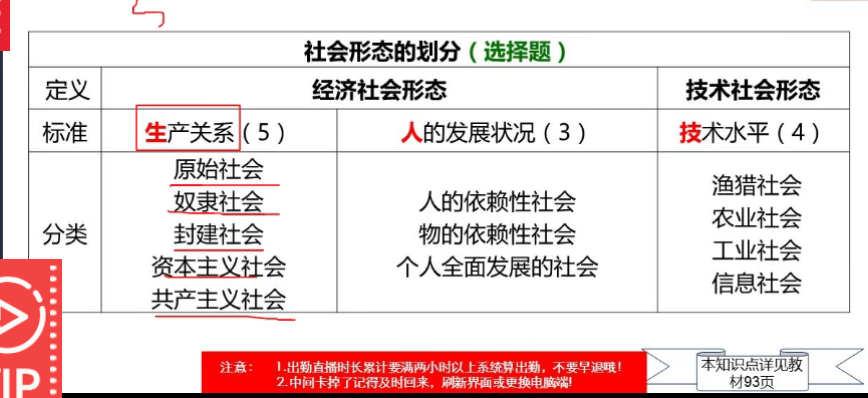
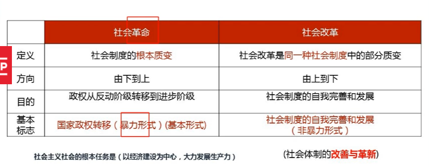

马克思主义的产生和发展

马克思主义诞生在**19世纪40年代 1840年** 鸦片战争

马克思主义三大组成部分 

马克思主义 哲学 马哲   借鉴的是 德国古典哲学 马克思的出生地 德国

马克思主义政治经济学 马政经   英国古典政治经济学  

科学社会主义  科社  英法空想社会主义  法 空想

马哲

德国古典哲学

**黑**格尔的辩证法   黑辩子

费尔巴**哈**的唯物主义    费物

简称 嘿哈  四个字对四个字

政治经济学

英国古典政治经济学

亚当 **斯密**

**大**卫 李嘉图    思密达  斯密 大

科设

英法空想社会主义

**圣**西门

傅**立**叶

**欧**文  胜利哦  圣 立 欧 

间接来源

细胞学说 生物进化论 能量守恒与转化定律

马克思产生的标志

《哲学的贫困》 《共产党宣言》

马克思的发展

中国特色社会主义理论体系 不包括 毛泽东思想

马克思主义科学内涵

马克思由马克思 、 恩格斯创立的，为他们的后继者所发展的

以反对资本主义、建设社会主义和共产主义为目标的科学的理论体系（反资建设共产）

它是关于工人阶级和人类解放的科学

马哲 是 科学的世界观和方法论

马政经 揭示了资本主义的发展规律

科学社会主义 理论处理核心地位

理论特征

马克思的科学性和革命性的统一

科学性

揭示自然界和人类社会发展的客观规律

不但揭示了规律，而且还接受了实践的检验，随着实践不断发展

革命性

彻底的**批判**精神 

鲜明的政治**立场**

马克思的**理论品质**  与时俱进

马克思主义社会理想

推翻资本主义 实现社会主义 和 **共产主义**

最高理想是**共产主义** **共同理想**是社会主义

最高理想是根本方向 必经阶段是共同理想

两共 不能同时出现

根本方法

**理论联系实际** 就是把马克思主义的基本原理作为指导，去观察和分析社会实际、工作实际和思想实际。

十月革命 世界上第一个社会主义国家 **苏维埃俄国**  解体的时间是1991年 

斯大林 社会主义的苏联模式

**二战** 社会主义事业从一国向多国

十八大

五位一体：经济建设、政治建设、文化建设、社会建设和生态文明建设

四个全面：全局建成小康社会、全面深化改革、全面依法治国、全面从严治党

十九大

新时代中国特色社会主义思想

八个明确  十四个基本方略

核心要义：坚持和发展中国特色社会主义

最本质的特征：党的领导  主要矛盾：人民日益增长的美好生活需要和不平衡不从分发展之间的矛盾

总布局：五位一体  战略布局 四个全面

全面深化改革   全面推进依法治国    新时代强军目标  大国外交

**完善和发展**中国特色社会主义制度、**推进**国家治理体系和治理能力现代化

建设中国特色社会主义**法治** 体系、建设社会主义法治国家

建设一支听党指挥、能打胜仗、作风优良的**人民军队**

构建新型**国际**关系、推动构建人类命运共同体

共产主义是按需分配

社会主义是按劳分配

科学社会主义一般原则

坚持 科学社会主义一般原则，不背离原则

把科学社会主义原则与本国实际相结合，创造性回答和解决国家问题

与时俱进，在不断丰富和发展科学社会主义一般原则

在实践中探索现实社会主义发展规律   

艰巨性和长期性

社会主义发展道路的多样性

客观性

科学社会主义理论与工人运动相结合的产物

工人阶级的先锋队

为实现**共产主义**而奋斗的党

为**人民**谋利益的党

民主集中制组织起来的团结统一的党

马克思主义政党是社会主义建设和改革的领导核心

思想：马克思主义是指导思想

政治：党要起到政治领导核心的作用，保证社会主义建设沿着正确的方向前进

组织：要在执政党的领导下，有组织、有系统、有管理、有序地进行

共产主义是人类最高的理想

共产主义的特征：经济

社会生产力高度发展和物质财富极大丰富

实行社会公有制和按需分配的分配原则

经济计划调节管理和商品经济消失

政治

阶级的消灭和国家自行消亡

精神

精神境界极大提高

人

人的自由而全面发展

全人类的彻底解放

劳动不再是谋生手段，而是生活需要

共产主义社会的两个阶段

社会主义社会 和共产主义社会

同一社会形态内部的过度和变化

社会主义是共产主义的必经阶段

物质世界和实践

世界的本原 第一性 本质

物质第一性 唯物主义

意识第一性 唯心主义

古代朴素唯物主义

近代形而上学  或 机械唯物主义

辩证唯物主义和历史唯物主义

唯心主义分为 主观唯心主义 客观唯心主义

主观是个人  客观是外力

感觉心 意识 是 主观

天理 上帝 绝对精神 客观

本原只有一个 统一 一元论

本原不只一个 否认统一 二元论

物质的唯一特性：客观实在性

客观实在性是一切物质的共性 

能认识，有同一性   不能认识，没有同一性

可知论					 

同一性

物质的根本属性和存在方式是运动

唯心主义的错误在于否认物质是运动的主体

形而上学的错误在于否认没有运动

物质是绝对运动和相对静止的统一

​      运动 的错误 只承认运动，否认相对静止 相对主义诡辩论

​	 静止 的错误 把静止绝对化，否认运动  形而上学

动中有静 静中有动 唯物辩证法

世界是如何存在的 存在状态

运动、联系、矛盾		辩证法

静止、孤立、否认矛盾		形而上学

时间和空间是物质运动的存在方式

时间 持续性、顺序性  特点 一维性 朝着一个方向不可逆

空间 广延性、伸张性 特点 三维性 长宽高确定空间

实践的概念、形式和特点

实践是主体能动地改造和探索客体的客观物质活动

实践的特点 能动性、客观性、社会历史性

实践的形式 物质生产实践 、 处理社会关系实践、科学实验

最基本的 物质生产实践

唯物辩证法的两大特征 联系和发展

三大规律 对立统一规律   质量互变规律  否定之否定规律

联系的特征

客观性 普遍性 多样性

发展

新事物代替旧事物 的过程  新事物：符合**规律**

原因 

**趋势** 新事物符合事物发展必然趋势 （根本原因、标志）

优越 新事物优越于旧事物

人民 新事物 符合广大人民群众的利益和要求，能得到广大人民群众支持和用户

对立统一规律（矛盾规律）

唯物辩证法和形而上学

任何事物都包含矛盾 矛盾双方既统一又斗争 由此推动事物运动变化发展

  基本属性 同一性和斗争性 统一 就是同一性 相互依存、相互转化

斗争性是 相互排斥

内部矛盾  内因   根据

外部矛盾  外因  条件

内外因的辩证关系

内因是事物发展变化的 根据

外因是事物发展变化的  条件

外因通过内因而起作用

普遍性和特殊性

任何事物 都 普遍性

每个事务 都有不一样 特殊性 具体问题具体分析

对立统一普遍性和特殊性的关系 

相互联结 相互区别 相互转换

矛盾的不平衡性

不同矛盾 主要矛盾 和次要矛盾  主要矛盾 处于支配地位，起决定作用

次要矛盾 处于服从地位

同一矛盾 主要方面 次要方面  主要 居于支配地位，起着主导作用的方面， 次要 处于被支配地位的方面

方法论;两点论和重点论统一

两点论二者不可偏颇  既要研究矛盾的主要方面又要研究矛盾的次要方面

重点论 在研究任何一种具体的矛盾时，要着重把握它的主要方面

同一个矛盾 分为主要方面和次要方面 

对立统一规律地位及其原因

地位对立统一规律是唯物辩证法的实质与核心，是根本规律

最根本的认识方法 矛盾分析法

质量互变规律

量变、质变、度

量变：事物数量（发展的规模、程度、速度灯）的增减，没有发生根本性变化

质变:事物发生根本性的变化，事物由一种质变向另一种质态的飞跃

度：界限

揭示事物的发展状态和形式的规律

否定之否定规律 辩证的否定观

批判+继承

形式： 螺旋式上升和波浪式前进，揭示了事物发展式前进性和曲折性的统一

揭示了事物发展的趋势和道路

对立统一规律是 动力和源泉

质量互变规律 是状态和形式

否定之否定规律是趋势和道路

五对范畴之 原因和结果

原因 引起某种现象

结果 被某种现象所引起的现象

 关系：

对立统一

1.原因和结果是对立的

2.相互依存和在一定情况下相互转化

3.原因和结果是相互作用

必然性和偶然性

含义：必然性。 事物联系和发展过程中**确定**不移的，不可避免的趋势

偶然性 **不确定**的趋势

关系 对立统一，相互作用

**机械决定论**

现实性和可能性

现实性 客观事物和现象的种种**联系** （已发生）

可能性 包含在现实事物之中的，预示着事物发展前途的种种**趋势**（未发生） 关系对立统一

内容和形式

内容。 构成事物一切**要素**的总和

形式。把内容各要素统一在一起的**结构**或表现**形式**    关系  对立 内容和形式含义不同

统一。相互作用

 

现象和本质

含义。 本质事物的根本性质以及组成事物基本要素的**内在联系**

现象。事物的表面特征以及这些特征的**外部联系**

关系。对立 现象是外部，本质是内部 现象是多变，本质稳定 统一。本质都要通过一定的现象表现出来

规律的特点

**客观性**  **不能创造** 或 消灭规律 只能认识规律 ，利用规律

**普遍性** 规律在很**大**范围和领域中起 作用

意识

起源 自然界长期发展的产物

社会性劳动的产物 决定因素

本质

人脑的机能  社会性产物   主观性和客观性的统一（人脑对客观世界的反映）

意识的能动作用的表现

意识具有目的性和计划性

意识具有主动性和创造性

意识能通过指导**实践**改造客观物质世界 最突出的表现

意识对于人的生理活动有影响作用

发挥主观能动性和尊重客观规律的关系

尊重客观规律是正确发挥主观能动性的**前提**

**认识和利客观规律**有必须充分发挥人的主观能动性  根本途径 是实践

解放思想实事求是

实事求是 是马哲的精髓

实事求是是党的思想路线和核心

坚持解放思想和实事求是的辩证统一

解放思想是前提 实事求是是目的

第二章 认识的本质及其规律

实践对认识发展的动力 标准 最终目的  来源

认识的本体和客体

我们认识到火是烫手的

主体是我们，火是客体

客体是主体实践和认识的对象

实践关系 相互作用关系 认识关系

我摸火  火烫我           我认识火

认识的本质：主体对客体能动的反映

唯物论的反映论与唯心论的认识论的对立

唯物论的反映论 对应唯心论的认识论

反映论存在决定思维   思维决定存在（先验论）

可知论与不可知论 的对立

实践检验可知论和不可知论

辩证唯物论的能动地反映论 						旧唯物论地机械反映论

认识 反映对象											消极地认识对象

实践 创造对象

改造与被改造

认识地辩证运动

感性认识 感觉、知觉、表象  感知表

理性认识 概念、判断、推理  概判推

认识的两次飞跃

第一次飞跃 感性到理性 第二次飞跃 理性到实践

完整的认识过程 

实践 - 认识 - 实践 的循环往复

认识过程的多次反复和有限与无限的辩证统一 反复的认识 **有限和无限的统一**

真理与价值

真理 正确的反映客观事物 

真理的属性

客观性 任何真理都包含不依赖于人的意识的客观内容

绝对性 无限发展得到物质世界是绝对

相对性  认识有待扩展、有待深化

实践是检验真理的唯一标准  客观规律

实践是一定历史条件下有**局限性**

实践可以检验一切认识

实践是检验真理的唯一标准

价值的含义

某物具有对人物有用或使人愉快

真理和价值的辩证关系

对立 真理和价值就是两个概念，不一样

统一 真理可以指导实践产生价值  正确的价值观在真理指导下形成

真理可以指导实践产生价值

真理的价值表现在真理的功能上

 真理 具有**指导实践**的功能

真理具有**再认识**的功能

真理具有**教育**和**激励**的功能

富强  国家

自由 公正 法治 社会

爱国 个人 公民

党的思想路线

坚持一切从实际出发的原则

坚持理论联系实际的原则

实事求是 是党的思想路线的核心 也是马克思主义哲学的精髓

党的思想路线坚持实践是检验真理的唯一标准

社会存在 社会**物质**生活条件的总和

物质生活资料生产方式

含义：**生产力和生产关系**

作用：**生产方式**在社会发展中起**决定作用**

地理环境 加速或延缓社会发转

人才 制约或影响

社会意识

对社会存在的反映

程度高低 社会心理 思想体系

是否具有阶级性      意识形态  （有阶级性）  **非意识形态**（无阶级性） 哲学是有阶级性的 就是意识形态

主体不同 个体意识 群体意识

社会存在 **决定** 社会意识

社会意识  **反作用** 社会存在

社会意识具有相对独立性

社会意识与社会存在变化发展的非完全同步性

社会意识与社会经济发展水平具有不平衡性

社会意识的发展具有历史继承性

社会意识各种形式之间相互作用和影响

社会意识对社会存在的反作用或称能动性 （最重要的表现）

社会基本矛盾及其运动规律

**社会存在和社会意识 历史唯物和历史唯心**

标志生产力发展水平的是**生产工具**

生产关系：物质生产中人和人之间的**经济关系**

公式是谁的？ **生产资料所有制形式** 决定性作用

人们再生产中的地位						 产品分配方式

现代生产力系统

实体性因素 劳动者、劳动资料和劳动对象

运筹性因素 分工协作、经济管理、预测决策

渗透性因素 自然科学

准备性因素 教育

生产力决定 决定生产关系

生产关系 反作用 生产力

**经济基础**：占统治地位的**生产关系**

上层建筑：社会意识形态以及与之相适应的政治法律制度和设施等的总和

**政治**上层建筑 制度军队警察和监狱 **主导地位**

**思想**上层建筑  法律思想、艺术、道德

经济基础 决定 上层建筑

上层建筑反作用于 经济基础

五生 三人 4技 

社会发展的特点

统一性  历史决定性 

多样性  主体选择性

历史观的基本问题是 社会存在与社会意识的关系问题

**基本动力**：社会基本矛盾

**直接动力**：**阶级斗争**

阶级首先是一个经济范畴，划分阶级的唯一标准是**经济标准**

阶级斗争的根源：物质利益的对立

社会历史发展的动力

人的本质 劳动 ：制造和使用工具

社会关系的总和（社会属性）

人民群众的作用（人民群众是历史的创造者）

物质财富的创造者 精神财富的创造者  人民群众是社会变革的决定力量

群众史观  英雄史观

历史唯物主义        历史唯心主义 否认了 群众史观

群众观点（马克思主义政党的根本观点）

全心全意为人民服务 根本宗旨

群众路线  党的根本工作路线

一切为了群众  最终归宿

一切依靠 群众  根本方法

从群众中来，到群众中去 领导方法

杰出人物的作用

先进思想和主张  核心和中流砥柱   促进和推动作用  对人类科学文化教育事业 的发展起着重要作用

肩负着伟大历史使命

方向和道路

人民的利益

无产阶级 胜利和成功

资本主义的形成

商品含义：为市场交换而生产的有用的产品

商品经济：商品生产+商品交换

社会分工的产生和存在

生产资料和劳动产品属于**不同的所有者**（决定性条件）

商品的属性 **使用价值**和**价值**

使用价值 			有用性         自然属性

价值（最本质因素）			凝结在商品中无差别的一般人类劳动（看不见的辛苦）			社会属性

  

生产商品的劳动的二重性 ： **具体劳动**和**抽象劳动**

具体 创造**使用价值**

抽象 创造**价值**

内在表现形式：商品的价值量

全社会劳动     社会必要劳动时间    社会价值

商品的价值量是由**社会必要劳动时间**决定的

个别劳动时间 > 社会必要劳动时间  亏本

个别劳动时间 < 社会必要劳动时间  盈利

商品价值量是同劳动生产率的关系

劳动生产率提高，劳动时间降低

劳动时间降低，商品的价值量减少、

单位商品的价值量与社会必要劳动时间成正比

​           					  与生产该商品的劳动生产率成反比

货币的本质

物物交换

物与一般等价物交换

物与**固定的一般等价物**

货币的职能

基本智能    价值尺度  	流通手段

支付手段

世界货币

商品经济的基本矛盾： **私人劳动和社会劳动的矛盾**

私人劳动：生产资料私有制 

社会劳动：劳动都是提供给社会的

矛盾：能否得到社会的认可，从私人劳动转化为社会劳动

**商品经济**的基本规律：**价值规律**

价值规律的表现形式：价格围绕价值上下波动

资产阶级革命的胜利初步确立了资本主义制度

**产业革命**使资本主义制度完全确立

条件：劳动力成为商品

货币转化为资本的关键是：

劳动力成为商品

劳动力成为商品的条件

劳动者有人身自由

劳动者丧失了一切生产资料和其他生活资料

劳动力商品的价值和使用价值

价值  ： 历史和道德

使用价值： 创造出劳动力自身价值更大的价值

劳动过程：工人在资本家的监督下，劳动产品归资本家所有

资本主义的生产过程：价值增殖过程

资本的价值构成：不变资本、可变资本

不变资本（c）：以生产资料形式存在的资本——非人

可变资本（v）：以劳动力形成存在的资本的价值，实现了价值增殖——人

资本主义生产中的剥削程度：**剩余价值率**

剩余价值率 m‘ = 剩余价值m 除以 可变资本 = 剩余劳动时间 除以 必要劳动时间

压榨剩余价值，通过两条途径：

提高剩余价值率，即提高对工人的剥削程度

增加可变资本总量，以雇佣更多的工人，扩大剥削范围

绝对剩余价值（延长工作日，提高劳动强度）

超额剩余价值 超额利润是个别生产价格低于社会生产价格的差额，是超额剩余价值的转化形式

个别资本家追求更多的剩余价值，资本家的直接目的，

社会劳动生产效率都提高了 新的剥削方法

相对剩余价值（社会劳动生产率提高） 潜移默化压榨

资本的本质：资产阶级和无产阶级之间剥削与被剥削的关系

资本积累

含义：把剩余价值再转化为资本，剩余价值是资本积累的源泉

剩余价值的唯一源泉是可变资本

实质

资本家用无偿占有工人创造的剩余价值

进行资本积累来增大规模

以便继续占有更多的剩余价值

从而占有不断增大的资本来扩大对工人的剥削和统治

单个资本的循环

买原材料 加工生产 卖了赚钱

**购买**阶段 **生产**阶段 **决定作用**   **销售**阶段					**循环阶段**

​					 生产剩余价值	实现剩余价值

货币资本	生产资本			**商品**资本			**资本职能**

单个资本的周转

这种不断重复、周而复始的资本循环过程，就是资本周转

根据**价值周转方式**的不同，生产资本可以划分为**固定资本**和**流动资本**

社会资本的再生产

社会资本再生产的核心问题：

​							社会总产品的各个构成部分是如何实现的

​							一是第一部类所生产的全部生产资料

​							二是第二部类所生产的全部消费资料

物质资料的总和

资本主义 经济危机

最根本的现象和典型特征：商品生产过剩

实质：生产相对过剩的危机

根源：资本主义生产的基本矛盾，生产的社会化与生产资料资本主义私人占有形式之间的矛盾

周期性爆发的原因：资本主义基本矛盾运动的阶段性

危机（决定）  萧条  复苏 高涨

资本主义国家制度（资本主义政治制度的核心）

国体：资产阶级专政

政体：君主立宪制（英国和日本）和民主共和制（美国）

人民民主专政

人民代表大会

资本主义政党制度

两党制 美国

多党制 法国 意大利

资本主义三权分立

行政权（政府） 立法权（议会） 司法权（法院）

议会或国会 监督权 财政权 立法权

资产阶级民主制的核心：议会制

本质是维护资产阶级的阶级利益，为资产阶级专政服务

资本主义的意识形态特点：历史进步性和阶级局限性

资本主义意识形态的核心：利己主义

自由到垄断

社会化生产力的发展

垄断形式

卡特尔 （同类产品） 辛迪加（流通环节） 托拉斯（全过程） 康采恩（超大垄断集团）

20世纪后半期垄断组织发展的形式 混合联合公司，经济全球化下，跨国公司

金融资本与金融寡头

金融资本：垄断的银行资本和工业资本

金融寡头：账务了金融资本，操纵国民经济命脉

金融寡头的统治方法

经济上：参与制

政治上：个人联合

垄断利润 

垄断资本获得的大大超过平均利润的高额利润

垄断利润主要是通过垄断组织制定的垄断价格来实现的 分为垄断高价和垄断低价

依靠私人垄断资本的力量，无法满足**大规模经济建设**

**公共设施**的建设上，私人垄断资本无能为力或不愿进行建设

**科学**研究项目，私人垄断资本不愿涉足

日益严重的生产过剩问题

社会化大生产的发展要求国家进行宏观调控

国家的再分配

总任务  ： 存进市场**总****供给和总需求**的平衡

调控手段，经济手段和法律手段

主要政策

财政政策 货币

垄断资本主义经济侵略的重要手段

借贷资本输出、生产资本输出

垄断资本主要打着 援助旗号 对其他国家进行剥削和控制，是一种新殖民主义

经济全球化和当代资本主义新变化

经济全球化的原因

新科学技术加强了国际经济联系

国际贸易的自由程度大大提高

国际资本流动的大幅增加

内容：

本质：资源配置的国际化

内容：生产全球化：贸易全球化和资本全球化

生产力 劳动生产率提高 三机 变四机 ，信息技术加入

生产关系 资本社会化（所有制），劳资关系；分配关系

上层建筑：政治制度与法制结合，国家管理经济和社会的职能增强，民主形式扩大

主要有三个方面：意识进行了社会改良，二是对经济实行政府干预和宏观调控，三是，加强对科技创新和新兴产业扶持

历史地位

马克思：发展社会劳动**生产力**，是资本主义的历史任务和存在理由。不自觉地为一个更高级地生产形式创造物质条件

社会主义必然会取代资本主义（生产关系一定要适合生产力状况）

物质条件——社会化大生产，社会条件——现代无产阶级，精神条件——马克思主义理论

国家垄断资本主义是社会主义地最充分地物质准备，是社会主义地前阶

过渡地过程是复杂地曲折的长期地历史过程

 