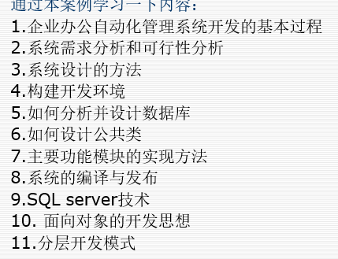
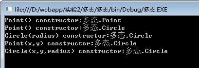

# web应用程序的工作原理

用户在浏览器地址栏输入URL地址

用户向浏览器发送访问首页的请求

服务器收取客户端的访问请求

服务器处理请求 （若首页动态文档需要经过数据处理再返回，若为静态文档直接返回改内容）

服务器将请求的处理结果在客户端的浏览器显示


```
ASP.NET的工作原理是：首先，有一个HTTP请求发送到Web服务器要求访问一个Web网页。  Web服务器通过分析客户的HTTP请求来定位所请求网页的位置。如果所请求的网页的文件名的后缀是 aspx，那么就把这个文件传送到aspnet_isapi.dll进行处理，由aspnet_isapi.dll把ASP.NET代码提交给CLR。如果以前没有执行过这个程序，那么就由CLR编译并执行，得到纯HTML结果；如果已经执行过这个程序，那么就直接执行编译好的程序并得到纯HTML结果。最后把这些纯HTML结果传回浏览器作为HTTP响应。浏览器收到这个响应之后，就可以显示Web网页。
```


静态网页


是一种静态的页面格式，不需要服务器解析其中的脚本

动态网页

由相应的脚本引擎来解释执行，根据指令生成静态网页


# 在.net平台中数据库的存取有哪个几个步骤

打开命名空间 using  System.Data; using System.Data.SqlClient;

 连接数据库SqlConnection  做数据源

打开连接 connection.Open();

做命令，生成命令，运行命令，取数据

关闭连接、释放资源


# 面对一个系统的时候应该怎么做

开发的基本过程

需求分析 和可行性分析

系统设计的方法

构建开发环境

如何分析并设计设计数据库

如何设计公共类

主要功能模块的实现方法

系统的编译与发布

SQL server技术

面向对象的开发思想

分层开发模式




CSS HTML 

内联式 嵌入式 外联式

内联式：CSS样式就是把CSS代码直接写在现有的HTML标签中

嵌入式：将CSS样式集中写在HTML页面的style标签中 \<head> 中

外联式：\<link>标签引入外部


C# 语言 值类型 引用类型 


值类型 就是一个包含实际数据量 double int float  布尔类型

引用类型 包括class 类 interface 数组 object string 

引用类型的变量不存储他们所代表的实际数据，而是存储他们实际数据的引用。

他们之间的关系 使用装箱拆箱 来完成他们之间的转换  装箱是指   值类型转换成 引用类型


封装类 多态类 计算类 堆栈类

# DataAdapter  DataReader  区别 优点缺点 有什么特点 各有什么好处

适用场景等 两种

DataSet  DataReader  

1. DataReader只能实现数据的查询，而DataAdapter则能实现数据的增删改查

  2.dataReader对内存的占用较小，因为它一次只查一条记录，而使用DataAdapter的查询结果是要放到Dataset或dataTable中的，所以如果数据量大的话，对内存的占用相对也是大的。

3.使用DataReader是需要与数据库一直保持连接的，直到不在使用，而DataAdapter是根据需要自动打开和关闭数据库的。

4.DataReader与DataAdapter在作用上并不相同，dataReader相当于一个容器，用来填充数据，而且一次只能填充一条记录，而DataAdapter是用来获取数据的，并把数据填充到数据集上。

# ADO.NET 封装类


sql

增删改查


插入

insert into  表名   （字段名） values  （值列表）


删除

delete from 表名 where 条件 

改 修改

update 表名 set 字段名 = 值  where 条件 

返回受影响的行数


查

select 字段名 from 表名  where 条件  group by 分组 having 分组结果集条件过滤 order by 排序字段列表 

```c#
using  namespace
using System；
using System.Collections.Generic;
using System.Linq;
using System.Web;
using System.Text;
using System.Data;
using System.Data.SqlClient;

public class Mydata
{
    string connstring;
   public Mydata()
    {
        connstring="Server=.;database=testDB;uid=sa;pwd=123456;";
    }
    public Mydata(string connstr)
    {
        connstring=connstr;
    }
    //查询用DataSet
    public DataSet ExeceSelect(string strSql,string strTable)
    {
        SqlConnection conn = new SqlConnection(connstring);
        SqlDataAdapter da = new SqlDataAdapter(strSql,conn);
        DataSet ds = new DataSet();
        conn.Open();
        da.Fill(ds,strTable);
        conn.Close();
        return ds;
        
    }
    //改删插
    public int ExecuteUpdateAndInsert(string strSql)
    {
        SqlConnection conn = new SqlConnection(connstring);
        SqlCommand com =  SqlCommand(strSql,conn);
        conn.Open();
        int iResult=com.ExecuteNonQuery();
        conn.Close();
        return iResult;
    
    }
    
    //保持连接
    public SqlDataReader GetDataReader(string sql)
    {
        SqlConnection conn = new SqlConnection(connstring);
        conn.Open();
        SqlCommand cmd = new SqlCommand(sql,conn);
        SqlDataReader dr= cmd.ExecuteReader();
        return dr;
    }
}

//实例化
class test
{
    static void Main(string[] args)
    {
        Mydata md = new Mydata();
        string sql = "select * from Student";
        string tmptable=" ";
        DataSet ds = md.ExeceSelect(sql,tmptable);
        DataRow row = ds.Tables[0].Rows[0];
        DataRow row1 = ds.Tables[0].Rows[1];
        Console.WriteLine(String.Format("{0},{1},{2},{3}",row[0],row[1],row[2]));
        Console.WriteLine(String.Format("{0},{1},{2},{3}",row1[0],row1[1],row[2]));
    }
}
```

新建的类 默认有4个命名空间

```c#
using System;
using System.Collections.Generic;
using System.Linq;
using System.Text;
```


# 计算类

一种计算类 普通的计算类

还有一种根据ADO.NET查询的结果进行计算


第一种普通C#计算类

```c#
public class jisuan
{
    int i_Length;//长度
    int[] i_Array;//数组
    int i_Max;//最大值
    int i_Min;//最小值
    int f_Avg;//平均值
	public jisuan()//默认构造
	{
    this.i_Length=5;
    this.i_Array = new int[] {1,2,3,4,5};
	}
    public jisuan(int size,int[] array)//有参构造
    {
        this.i_Length=size;
        this.i_Array=array;
    
    }
    //以上是 成员变量的定义 构造函数
    //以下是 功能函数
    public int Max()//最大值
    {
        i_Max = i_Array[0];
        for(i = 1; i < i_Length;i++)
        {
            if(i_Max < i_Array[i])
                i_Max=i_Array[i];
        }
        return i_Max;
    }
    public int Min()//最小值
    {
        i_Min=i_Array[0];
        for(i=1;i<i_Length;i++)
        {
            if(i_Min>i_Array[i])
                i_Min=i_Array[i];
        
        }
        return i_Min;
    }
    public float Avg()//平均值
    {
        int sum = 0;
        for(int i = 0; i < i_Length;i++)
        {
            sum= sum + i_Array[i];
        }
        f_Avg=sum / i_Length;
        return f_Avg;
        
    }
}


//还有一个类对上面的类使用 实例化
using System;
using System.Collections.Generic;
using System.Text;
using System.Linq;
class test
{
    static void Main(string[] args)
    {
        jisuan js = new jisuan();
        Console.WriteLine("最大值："+js.Max());
        Console.WriteLine("最小值:"+js.Min());
        Console.WriteLine("平均值："+ js.Avg());
        
        Console.WriteLine("输入数组的长度：");
        int size = Convert.ToInt32(Console.ReadLine());
        int[] a = new int[size];
        for(int i = 1; i <= a.Length;i++)
        {
            Console.WriteLine(“请输入第”+i+“个数组的值：”);
            a[i-1]= Convert.ToInt32(Console.ReadLine());
        }
        jisuan js_2 = new jisuan(size,a);
                Console.WriteLine("最大值："+js_2.Max());
        Console.WriteLine("最小值:"+js_2.Min());
        Console.WriteLine("平均值："+ js_2.Avg());
        Console.ReadLine();
    }
}
```


ADO.NET计算类

```C#
using System;
using System.Collections.Generic;
using System.Linq;
using System.Web;
using System.Data;
using System.Data.SqlClient;

public class JS
{
    Mydata md = new Mydata();
    private string Course;
    private SqlDataReader dr;
    public JS()
    {
        Course=" ";
    }
    public JS(Course)
    {
        this.Course=Course;
    }
    public float MaxScore()
    {
        float temp=0;max=0;
        dr = md.GetDataReader("select Score from v_st_score where courseName='"+Course + "''" );
        while(dr.Read())
        {
            temp=float.Parse(dr[0].ToString());
            if(temp > max)
                max=temp;
        }
        return max;
    }
    public float MinScore()
    {
        float temp=0;min=100;
        dr=md.GetDataReader("select Score from v_st_score where courseName='"+Course + "''" );
        while(dr.Read())
        {
            temp = float.Parse(dr[0].ToString());
            if(temp<min)
                min=temp;
        }
        return temp;
    }
    public float AvgScore()
    {
        int t = 0;
        float sum = 0;
        dr = md.GetDataReader("select Score from v_st_score where courseName='"+Course+"''");
        while(dr.Read())
        {
            t++;
            sum+=float.Parse(dr[0].ToString());
        }
        return sum / t;
    }
}
```


# 堆栈


```c#
using System;
public class StackTp
{
    int MaxSize;
    int Top;
    int[] data;
    public StackTp()
    {
        MaxSize=100;
        Top=0;
        data=new int[MaxSize];
    }
    public StackTp(int size)
    {
        MaxSize = size;
        Top=0;
        data=new int[MaxSize];
    }
    public bool IsEmpty()
    {
        if(Top==0)
        	return true;
        else 
            return false;
    }
    public bool IsFull()
    {
        if(Top == MaxSize)
            return true;
        else
            return false;
    }
    public void Push(int x)//入栈
    {
        if(IsFull())
        {
            Console.WriteLine("Stack is full");
            return;
        }
        data[Top++]=x;
        
    }
    public void Pop()//出栈
    {
        is(IsEmpty())
        {
            Console.WriteLine("Stack is empty");
            return -1;
        }
        return data[--Top];
        
    }
}

//调用
public class test
{
    static void Main(string[] args)
    {
       Console.WriteLine("顺序栈");
       StackTp st = new StackTp(20);
       Console.WriteLine("出战"+st.Pop());
        for(int i = 0; i < 20; i ++)
        {
            int datai=i+1;
            st.Push(datai);
            Console.WriteLine("入栈"+datai);
        }
        while(!st.IsEmpty())
        {
            Console.WriteLine("出栈"+st.Pop());
        }
        Console.ReadLine();
        
      
    }
}
```


# 多态


```C#
using System;
class Point
{
    private int x,y;
    public Point()
    {
        x = 0;
        y=0;
        Console.WriteLine("Point() constructor:{0}",this);
        
    }
    public Point(int x, int y)
    {
        this.x=x;
        this.y=y;
        Console.WriteLine("Point(x,y) constructor:{0}",this);
    }
}

class Circle:Point
{
    private double radiuse;
    public Circle()
    {
        Console.WriteLine("Circle() constructor:{0}",this);
        
    }
    public Circle(double radius):base()
    {
        this.radius=radius;
        Console.WriteLine("Circle(radius) constructor:{0}",this);
        
    }
    public Circle(int x , int y ,double radius):base(x,y)
    {
        this.radius=radius;
        Console.WriteLine("Circle(x,y,radius) constructor:{0}",this);
    }
}


class test
{
    static void Main(string[] args)
    {
        Point a = new Point();
        Circle b = new Circle(3.5);
        Circle c = new Circle(1,1,4.8);
        Console.ReadLine();
    }
}
```

